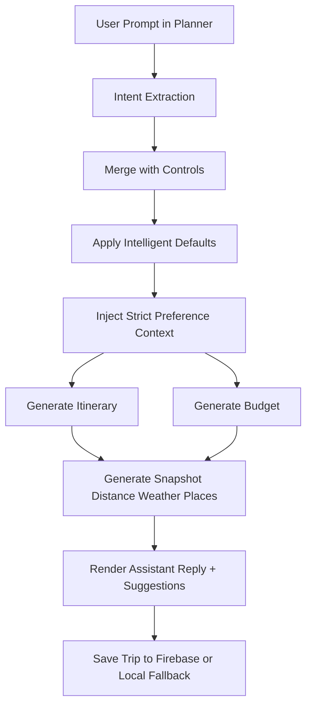

# AI Travel App - Detailed Project Analysis

Last updated: 2026-06-22

This README is a deep technical analysis of the current codebase, including:

- project requirements and how they were implemented
- architecture and data flow
- what is active now vs what is legacy/parked
- page/service/module level behavior
- quality, testing, CI, and current verification status
- file-by-file responsibility index

---

## 1. Project Intent and Requirement History

This project started as an AI travel planning app and has been evolving toward a production-grade, live-data travel platform.

### Core product goal

Build a practical Travel OS that can:

1. take natural language prompts
2. generate itinerary + budget
3. enrich plans with real-world data (route, weather, nearby places, photos)
4. allow account-based save/revisit flows
5. operate safely with strict no-mock policy controls

### Important requirement tracks implemented

#### A) Data migration requirements (live-data first)

- no-mock policy and live-data preference flags
- shared cache buckets for major data domains
- live destination photos, dynamic trending, and lifecycle-state coverage on key pages

#### B) Planner UX and behavior requirements (latest)

Recent user-driven requirements were:

1. planner should feel normal prompt-first, not overloaded
2. quick controls should not clutter main planner area
3. preferences should open from a button near planner chat area
4. plan output must actually follow user preferences

Current implementation satisfies this with:

- prompt-first planner flow in `src/pages/Planner.vue`
- preferences modal invoked by `Trip Preferences` / `Edit Preferences` button
- preference lock behavior to prevent parser overrides of user-applied values
- explicit preference context injection into itinerary and budget generation prompts

---

## 2. What Has Been Built (Scope and Size)

Implementation footprint in current repository snapshot:

| Area | File Count |
| --- | ---: |
| `src/pages` | 13 |
| `src/services` | 17 |
| `src/services/ai` | 5 |
| `src/services/maps` | 2 |
| `src/services/travel` | 2 |
| `src/services/photo` | 1 |
| `src/modules` | 22 |
| `src/features` | 22 |
| `src/core` | 8 |
| `src/schemas` | 5 |
| `src/types` | 4 |
| `tests/unit` | 7 |
| `tests/component` | 7 |
| `tests/integration` | 1 |
| `tests/e2e` | 1 |
| `docs` | 4 |

This is not a small demo anymore. It has production-oriented quality gates, service layering, caching, observability, validation schemas, and multiple runtime modules.

---

## 3. Architecture at a Glance

### Active runtime path

`src/main.js` -> `src/App.vue` -> `src/router/index.js` -> routed pages under `src/pages`

### Runtime initialization sequence

1. Create Vue app + Pinia + Router in `src/main.js`
2. Initialize network monitor + global error handlers (`src/core/monitoring`)
3. Initialize auth session through `src/stores/auth.js`
4. Mount app

### End-to-end planning flow (active)



### Service layering strategy

- Compatibility facades in `src/services/*.js` keep old imports stable.
- Real logic is mostly in:
  - `src/services/ai/*.ts`
  - `src/services/maps/*.ts`
  - `src/services/travel/*.ts`
  - `src/services/photo/*.ts`
- Core cross-cutting infra:
  - `src/core/cache`
  - `src/core/errors`
  - `src/core/logger`
  - `src/core/monitoring`

---

## 4. Routes and Access Rules

Active route registry is in `src/router/index.js`.

| Path | Page | Access |
| --- | --- | --- |
| `/` | Home | public |
| `/destination` | Destination directory | public |
| `/destination/:id` | Destination details | public |
| `/planner` | Planner workspace | public |
| `/login` | Login/signup | guest-only |
| `/dashboard` | Dashboard | requires auth |
| `/saved-trips` | Saved trips | requires auth |
| `/help` | Help center | public |
| `/guides` | redirect to `/help?topic=overview` | public |
| `/security` | redirect to `/help?topic=security` | public |
| `/faq` | redirect to `/help?topic=overview` | public |
| `/api-keys` | redirect to `/help?topic=api` | public |
| `/:pathMatch(.*)*` | NotFound | public |

Auth guards:

- if route has `requiresAuth` and user not authenticated -> redirect to `/login?redirect=<target>`
- if route has `guestOnly` and user authenticated -> redirect to `/dashboard`

---

## 5. Detailed Page Responsibilities

### Home (`src/pages/Home.vue`)

Purpose:

- entry command center for prompt-based planning
- show dynamic live trending categories
- show popular live destination cards with lazy photo hydration and route distance labels

Data behavior:

- detects user location
- initializes currency
- loads trending + destination suggestions in parallel
- resolves route distances to popular destinations

State handling:

- separate loading/error handling for trending and popular destination sections

### Destination Directory (`src/pages/Destination.vue`)

Purpose:

- discover and filter destinations
- analyze Google Maps URL or coordinates input

Behavior:

- local filters: budget cap and season text
- maps analyzer parses URL/coordinates and routes to destination details with query context

### Destination Details (`src/pages/DestinationDetails.vue`)

Purpose:

- destination intelligence workspace with tabs

Tabs:

- overview
- attractions
- hotels
- food
- transport
- weather

Behavior:

- loads comprehensive details from AI/recommendation service
- fetches real location data in parallel
- route analysis from user origin city
- traffic insights integration
- auto-refresh every 90 seconds for live location intelligence (and traffic if route analyzed)

### Planner (`src/pages/Planner.vue`)

Purpose:

- core prompt-first trip generation + refinement + save flow

Current design behavior:

- single prompt input drives generation
- conversation timeline for user/assistant messages
- recent trip reuse support
- trip snapshot generation (distance/weather/nearby attractions/hotels/restaurants)
- save plan flow with auth-aware redirection

Preference UX behavior (latest implementation):

- preferences live in modal (not inline quick-controls block)
- modal opens from button near planner interaction area
- apply preferences sets `preferencesLocked = true`
- when locked, intent patch cannot override key fields
- strict preference block is appended to generation prompt
- applied preferences panel rendered in results

### Dashboard (`src/pages/Dashboard.vue`)

Purpose:

- account-level planning overview and intelligence dashboard

Features:

- totals for trips, planned days, and budget footprint
- recent trip list
- live geo snapshot (weather/hotels/restaurants near current location)
- travel intelligence widget grid loaded via async feature module

### Saved Trips (`src/pages/SavedTrips.vue`)

Purpose:

- persistent trip archive with full itinerary modal review

Features:

- list + delete saved plans
- destination cover image mapping
- detailed itinerary modal overlay
- optional roadtrip intelligence panel render when trip payload includes roadtrip data

### Help (`src/pages/Help.vue`)

Purpose:

- consolidated support center for usage, security, and API setup topics

### Login (`src/pages/Login.vue`)

Purpose:

- user authentication entry (login/signup)

### NotFound (`src/pages/NotFound.vue`)

Purpose:

- fallback page for unmatched routes

### Legacy support pages still present in codebase

- `src/pages/Guides.vue`
- `src/pages/Security.vue`
- `src/pages/Faq.vue`
- `src/pages/ApiKeys.vue`

These are currently replaced by Help route redirects.

---

## 6. Planner Requirement Mapping (What Was Asked vs What Was Built)

### Requirement 1

"planner ko normal prompt based banao"

Implemented as:

- prompt-first generation path in `handleGenerate`
- assistant response + actionable suggestions + refinement prompts
- reduced control clutter in primary planner layout

### Requirement 2

"quick control wali chiz hatao"

Implemented as:

- inline quick controls removed from main planner flow
- preferences moved to modal UX

### Requirement 3

"chat ke pass ek button ho jahan se fields fill ho"

Implemented as:

- `Trip Preferences` / `Edit Preferences` buttons around planner interaction context
- full preferences modal with all major fields

### Requirement 4

"preferences ke hisab se plan modify hona chahiye"

Implemented as:

- preferences lock mode
- lock-aware merge that blocks intent-parser override of locked keys
- strict preference context injected into both itinerary and budget generation calls
- visible applied preferences in output section

---

## 7. Service Architecture (Detailed)

## 7.1 Compatibility Facades

- `src/services/gemini.js`
- `src/services/weather.js`
- `src/services/places.js`
- `src/services/routes.js`

These files preserve old import paths while forwarding calls to newer domain services.

## 7.2 AI Domain (`src/services/ai`)

### `planner.service.ts`

- central flags and Gemini request helpers
- exports:
  - `GEMINI_API_KEY`
  - `REAL_DATA_ONLY`
  - `NO_MOCK_DATA_POLICY`
  - `DEMO_MODE`
  - JSON extraction and Gemini JSON request utilities

### `intent.service.ts`

- hybrid parser:
  - heuristic extraction
  - optional Gemini parsing when configured
- supports multilingual/ normalization patterns
- extracts destination, days, travelers, budget, style, travel mode, stay and food preferences

### `itinerary.service.ts`

- generates travel itinerary using:
  - destination geocode
  - weather + nearby places enrichment
  - Gemini JSON generation (when key exists)
- fallback behavior:
  - computed local simulation if allowed by policy/options

### `budget.service.ts`

- generates itemized budget using:
  - route distance
  - hotels + restaurants context
  - style/stay/food multipliers
  - optional Gemini budget response
- fallback behavior:
  - deterministic computed budget if allowed by policy/options

### `recommendation.service.ts`

- destination suggestion and detail pipeline
- uses cache buckets for search and destination details
- supports demo mode paths when policy allows
- resolves live destination photos through photo provider

## 7.3 Maps Domain (`src/services/maps`)

### `geocoding.service.ts`

- maps input parser + geocode helper
- provider strategy includes external geocoding providers with fallback

### `route.service.ts`

- route distance + route intelligence + traffic insights
- tries API provider data when available
- uses haversine + heuristic fallbacks based on policy and key availability
- route cache integration (`route_cache`)

## 7.4 Travel Domain (`src/services/travel`)

### `weather.service.ts`

- provider order:
  1. OpenWeather (if key)
  2. Open-Meteo (keyless)
  3. static fallback only when policy allows

### `places.service.ts`

- provider order:
  1. Google Places API (if key)
  2. Overpass API (keyless)
  3. local fallback only when policy allows

## 7.5 Photo Domain (`src/services/photo`)

### `provider.service.ts`

- live destination photo resolver
- provider order:
  1. Google Places photo path
  2. Unsplash live URL fallback
- photo cache integration (`photo_cache`)

## 7.6 Platform Services

### `firebase.js`

- cloud-first auth + trip persistence when Firebase env configured
- localStorage fallback mode when Firebase unavailable
- supports login/signup/logout/session observe + trip save/list/delete

### `location.js`

- user location detection with optional geolocation prompt
- IP fallback via `ipapi.co`
- strict-mode behavior can return Unknown instead of fake defaults

### `currency.js`

- currency inference from location/IP/timezone
- conversion + formatting utility for UI values

---

## 8. Core Platform and Observability

Core folder: `src/core`

### Cache (`src/core/cache/dataCache.js`)

- memory + localStorage hybrid cache
- in-flight request dedupe
- buckets implemented:
  - `destination_cache`
  - `search_cache`
  - `weather_cache`
  - `photo_cache`
  - `route_cache`

### Errors (`src/core/errors/index.js`)

- normalized AppError model
- user-friendly error text derivation

### Logger (`src/core/logger/index.js`)

- namespaced level-based logging
- controlled by `VITE_LOG_LEVEL`

### Monitoring (`src/core/monitoring/*`)

- global error capture
- request timeout/retry wrapper
- online/offline tracking
- reusable loading state primitive

Bootstrap integration:

- `initNetworkMonitoring()` and `installGlobalErrorHandlers(app)` are called in `src/main.js`

---

## 9. State, Storage, and Data Contracts

### Active store

- `src/stores/auth.js` is active Pinia store for auth/session data

### Persistence modes

- Firebase mode: cloud auth + Firestore trips
- Local fallback mode: localStorage auth session/users/trips

### Type contracts (`src/types`)

- `Trip.ts`
- `Destination.ts`
- `Itinerary.ts`
- `Budget.ts`

### Runtime schema validation (`src/schemas`)

- `trip.schema.ts`
- `destination.schema.ts`
- `itinerary.schema.ts`
- `budget.schema.ts`
- `parse.ts` helper for safe schema parsing and fallback handling

---

## 10. Modules and Features: Active vs Parked vs Legacy

## 10.1 Active modules in routed runtime

### Trending engine

- `src/modules/trending/engine.js`
- active usage: Home page

### Travel intelligence aggregator

- `src/modules/travel-intelligence/service.js`
- active usage: Dashboard page

### Travel intelligence widgets

- `src/features/travel-intelligence/widgets/*`
- active usage: Dashboard widget grid

### Roadtrip panel (conditional render)

- `src/features/roadtrip/RoadtripIntelligencePanel.vue`
- active usage: SavedTrips modal only when saved trip contains roadtrip payload

## 10.2 Present but currently not wired in active routed pages

### Planner options module

- `src/modules/planner-options/index.js`
- scoring/ranking engine for Budget/Balanced/Premium options
- comparison UI exists in `src/features/planner/PlanComparisonView.vue`

### Profile-memory module

- `src/modules/profile-memory/*`
- includes memory storage, scoring, personalization planning
- architecture documented, but active planner currently does not import this module directly

### Command-center memory module

- `src/modules/command-center/prompt-memory.js`
- prompt history/saved prompts persistence API

### Roadtrip engine module

- `src/modules/roadtrip/*`
- generation engine with TTL in-memory cache
- no direct active import from routed pages for generation in current snapshot

## 10.3 Legacy-linked feature components

Several feature components still align with old `src/app` store architecture and are not part of the active routed shell.

Examples:

- `src/features/assistant/CopilotPanel.vue`
- `src/features/budget/BudgetForecaster.vue`
- `src/features/weather/WeatherIntelligence.vue`
- `src/features/maps/RoadtripMap.vue`
- `src/features/dashboard/RecentPrompts.vue`
- `src/features/roadtrip/RoadtripEngine.vue`

---

## 11. Legacy Runtime Tree (`src/app`) vs Active Runtime (`src/`)

### Active runtime

- entry: `src/main.js`
- shell: `src/App.vue`
- router: `src/router/index.js`
- pages: `src/pages/*`

### Legacy runtime tree present but not mounted by current entrypoint

- `src/app/App.vue`
- `src/app/router/index.js`
- `src/app/pages/Home.vue`
- `src/app/stores/*`
- `src/app/services/*`

This legacy tree is useful historical context but not the currently mounted app shell.

---

## 12. Environment Variables and Flags

Template file: `.env.example`

### Required

- `VITE_GEMINI_API_KEY`

### Recommended live-data providers

- `VITE_GOOGLE_MAPS_API_KEY`
- `VITE_OPENWEATHER_API_KEY`
- `VITE_TOMTOM_API_KEY`

### Firebase (optional, required for cloud auth/trip persistence)

- `VITE_FIREBASE_API_KEY`
- `VITE_FIREBASE_AUTH_DOMAIN`
- `VITE_FIREBASE_PROJECT_ID`
- `VITE_FIREBASE_STORAGE_BUCKET`
- `VITE_FIREBASE_MESSAGING_SENDER_ID`
- `VITE_FIREBASE_APP_ID`

### Behavior flags

- `VITE_REAL_DATA_ONLY=true`
  - true: prefer live-only behaviors in critical flows
  - false: allow relevant fallback paths

- `VITE_NO_MOCK_DATA_POLICY=true`
  - true: globally enforce no-mock policy where implemented
  - false: allow demo/mock paths

- `VITE_DEMO_MODE=false`
  - only effective when `VITE_NO_MOCK_DATA_POLICY=false`

- `VITE_LOG_LEVEL=info`
  - `debug | info | warn | error | off`

---

## 13. Build, Test, and Quality Stack

### Tooling

- Vite build: `vite.config.js`
- ESLint flat config: `eslint.config.js`
- Vitest config + thresholds: `vitest.config.js`
- Playwright e2e config: `playwright.config.js`
- Lighthouse quality assertions: `lighthouserc.json`
- CI pipeline: `.github/workflows/ci.yml`

### Available scripts

```bash
npm run dev
npm run build
npm run preview
npm run analyze:bundle

npm run lint
npm run test
npm run test:unit
npm run test:component
npm run test:integration
npm run test:coverage
npm run test:e2e
npm run test:e2e:ui

npm run lighthouse
npm run quality:check
```

### Coverage policy (enforced)

Thresholds in `vitest.config.js`:

- statements >= 80
- branches >= 80
- functions >= 80
- lines >= 80

---

## 14. Current Verification Snapshot (Executed on 2026-06-22)

### Build

- `npm run build`: PASS

### Tests

- `npm run test`: PASS
  - test files: 15
  - tests: 77

### Coverage

- `npm run test:coverage`: PASS
  - statements: 95.11%
  - branches: 82.22%
  - functions: 100%
  - lines: 95.62%

### Lint

- `npm run lint`: FAIL
  - file: `src/services/ai/intent.service.ts`
  - 7 errors: `no-misleading-character-class`
  - issue context: multilingual regex character classes

### E2E and Lighthouse

- not re-run in this documentation update session
- configured in scripts and CI workflow

---

## 15. CI/CD Pipeline

Workflow file: `.github/workflows/ci.yml`

Jobs:

1. `quality`
   - install
   - lint
   - unit/component/integration tests
   - coverage threshold gate
   - build
2. `e2e`
   - Playwright smoke tests
3. `lighthouse`
   - Lighthouse score assertions on `/` and `/planner`

Artifacts uploaded:

- `coverage-report`
- `playwright-report`
- `lighthouse-report`

---

## 16. Security, SEO, and UX Baselines

### SEO basics

- `index.html` includes `meta description`
- `public/robots.txt` allows crawling (`Disallow:` empty)

### Auth and data safety

- protected routes guarded in router
- auth session abstraction supports cloud and local fallback
- no hardcoded secrets in source; key use through env vars

### Error and network resilience

- global + request-level error capture
- retry and timeout strategy in request wrapper
- offline state awareness

---

## 17. Documentation Index

- `docs/data-os-migration-roadmap.md`
  - migration phases and no-mock policy direction
- `docs/deployment-production.md`
  - release gates and deployment checklist
- `docs/observability-architecture.md`
  - logger/errors/monitoring/request architecture
- `docs/profile-memory-architecture.md`
  - profile-memory module design and intended integration

---

## 18. Known Gaps and Open Work

1. Resolve lint issues in multilingual regex implementation (`intent.service.ts`).
2. Align docs and active wiring for profile-memory integration (architecture exists, active import currently absent in planner).
3. Continue de-duplication between active `src/` runtime and legacy `src/app` tree.
4. Consider either wiring or pruning parked modules (`planner-options`, `command-center`, roadtrip generator) to reduce ambiguity.
5. Re-run and maintain e2e + lighthouse gates after major UI text/structure changes.

---

## 19. Detailed File Responsibility Index

This section maps key files to responsibilities for quick audit and onboarding.

### Root and config

- `package.json`: scripts, dependencies, quality command surface.
- `vite.config.js`: Vue plugin, manual chunking, optional bundle analyzer.
- `vitest.config.js`: test environment, include/exclude, coverage thresholds.
- `playwright.config.js`: e2e setup, retries, web server settings.
- `lighthouserc.json`: lighthouse route targets and minimum score gates.
- `eslint.config.js`: lint policy for JS/Vue/TS and ignored paths.
- `index.html`: app mount point, viewport and meta description.
- `.env.example`: required and optional env variables plus behavior flags.
- `public/robots.txt`: crawler policy baseline.

### Core runtime

- `src/main.js`: app bootstrap, monitoring install, auth init.
- `src/App.vue`: active shell (navbar, profile menu, mobile nav, route transitions).
- `src/router/index.js`: active routes + auth guards + support redirects.

### Core platform (`src/core`)

- `src/core/cache/dataCache.js`: shared TTL cache + bucket management + in-flight dedupe.
- `src/core/errors/index.js`: AppError normalization and friendly messaging.
- `src/core/logger/index.js`: namespaced logger with log-level controls.
- `src/core/monitoring/index.js`: monitoring event bus.
- `src/core/monitoring/request.js`: retryable request wrapper with timeout and telemetry.
- `src/core/monitoring/global.js`: global runtime error hooks.
- `src/core/monitoring/network.js`: network online/offline state tracking.
- `src/core/monitoring/loading.js`: loading-state utility composable.

### Pages (`src/pages`)

- `src/pages/Home.vue`: landing command center + trending + popular cards.
- `src/pages/Destination.vue`: searchable destination directory + maps analyzer.
- `src/pages/DestinationDetails.vue`: destination deep intelligence tabs.
- `src/pages/Planner.vue`: prompt-first planner, preference modal lock, generation pipeline.
- `src/pages/Login.vue`: login/signup UI and auth handoff.
- `src/pages/Dashboard.vue`: user metrics + live snapshot + intelligence widgets.
- `src/pages/SavedTrips.vue`: saved trip archive + itinerary overlay + delete flow.
- `src/pages/Help.vue`: consolidated support/help center.
- `src/pages/NotFound.vue`: fallback unmatched-route page.
- `src/pages/Guides.vue`: legacy support page (redirected route path).
- `src/pages/Security.vue`: legacy support page (redirected route path).
- `src/pages/Faq.vue`: legacy support page (redirected route path).
- `src/pages/ApiKeys.vue`: legacy support page (redirected route path).

### Services (`src/services`)

- `src/services/gemini.js`: compatibility exports for AI/maps/travel APIs.
- `src/services/weather.js`: compatibility export for weather service.
- `src/services/places.js`: compatibility export for places service.
- `src/services/routes.js`: compatibility export for route service.
- `src/services/firebase.js`: auth and trip persistence (Firebase/local fallback).
- `src/services/location.js`: geolocation/IP lookup and user location state.
- `src/services/currency.js`: currency detection and conversion/formatting.

#### AI services

- `src/services/ai/planner.service.ts`: Gemini endpoint helpers and policy flags.
- `src/services/ai/intent.service.ts`: intent extraction with multilingual heuristics.
- `src/services/ai/itinerary.service.ts`: itinerary generation and fallback simulation.
- `src/services/ai/budget.service.ts`: budget generation with preference-aware economics.
- `src/services/ai/recommendation.service.ts`: destination search/details/location intelligence.

#### Maps and travel services

- `src/services/maps/geocoding.service.ts`: maps input parsing and geocoding.
- `src/services/maps/route.service.ts`: route distance, route intelligence, traffic insights.
- `src/services/travel/weather.service.ts`: weather fetch pipeline and fallbacks.
- `src/services/travel/places.service.ts`: nearby places fetch pipeline and fallbacks.
- `src/services/photo/provider.service.ts`: live destination photo provider strategy.

### Modules (`src/modules`)

#### Trending

- `src/modules/trending/engine.js`: dynamic category generation and enrichment.

#### Travel intelligence

- `src/modules/travel-intelligence/index.js`: module export surface.
- `src/modules/travel-intelligence/service.js`: dashboard aggregation orchestration.
- `src/modules/travel-intelligence/services/weather-intelligence.js`: weather intelligence score model.
- `src/modules/travel-intelligence/services/traffic-intelligence.js`: traffic intelligence score model.
- `src/modules/travel-intelligence/services/crowd-intelligence.js`: crowd intelligence score model.
- `src/modules/travel-intelligence/services/season-intelligence.js`: season recommendation logic.
- `src/modules/travel-intelligence/services/safety-intelligence.js`: safety signal synthesis.
- `src/modules/travel-intelligence/services/cost-intelligence.js`: cost signal synthesis.
- `src/modules/travel-intelligence/services/utils.js`: shared utility helpers.

#### Roadtrip

- `src/modules/roadtrip/index.js`: module export surface.
- `src/modules/roadtrip/service.js`: roadtrip engine orchestration and cache.
- `src/modules/roadtrip/constants.js`: roadtrip constants and mode metadata.
- `src/modules/roadtrip/estimators.js`: fuel/toll/ev estimators.
- `src/modules/roadtrip/scenic.js`: scenic and road condition planning.
- `src/modules/roadtrip/spots.js`: sunrise/sunset and photo stop builders.

#### Planner options

- `src/modules/planner-options/index.js`: profile generation + scoring/ranking engine.

#### Profile memory

- `src/modules/profile-memory/index.js`: module export surface.
- `src/modules/profile-memory/storage.js`: profile memory persistence and updates.
- `src/modules/profile-memory/scoring.js`: memory confidence scoring.
- `src/modules/profile-memory/personalization.js`: memory-based input personalization.

#### Command center

- `src/modules/command-center/prompt-memory.js`: prompt history/saved prompt persistence.

### Features (`src/features`)

#### Active or conditionally active features

- `src/features/travel-intelligence/index.js`: widget export surface.
- `src/features/travel-intelligence/widgets/WeatherIntelligenceWidget.vue`: weather intelligence card.
- `src/features/travel-intelligence/widgets/TrafficIntelligenceWidget.vue`: traffic intelligence card.
- `src/features/travel-intelligence/widgets/CrowdIntelligenceWidget.vue`: crowd intelligence card.
- `src/features/travel-intelligence/widgets/SeasonIntelligenceWidget.vue`: season intelligence card.
- `src/features/travel-intelligence/widgets/SafetyIntelligenceWidget.vue`: safety intelligence card.
- `src/features/travel-intelligence/widgets/CostIntelligenceWidget.vue`: cost intelligence card.
- `src/features/roadtrip/RoadtripIntelligencePanel.vue`: roadtrip telemetry panel UI.
- `src/features/roadtrip/RoadtripMiniMap.vue`: canvas mini-map visualization.
- `src/features/planner/PlanComparisonView.vue`: 3-plan comparison widget (currently parked in active planner flow).

#### Legacy-linked feature UI (not primary active runtime path)

- `src/features/assistant/CopilotPanel.vue`: old assistant side panel.
- `src/features/budget/BudgetForecaster.vue`: old budget forecasting panel.
- `src/features/weather/WeatherIntelligence.vue`: old weather intelligence panel.
- `src/features/maps/RoadtripMap.vue`: old map rendering feature.
- `src/features/dashboard/RecentPrompts.vue`: old dashboard prompt list.
- `src/features/roadtrip/RoadtripEngine.vue`: old roadtrip engine component.
- `src/features/command-center/CommandComposer.vue`: command center input composer.
- `src/features/command-center/ControlMatrix.vue`: command center controls layout.
- `src/features/command-center/PromptCollection.vue`: prompt list/persistence UI.
- `src/features/command-center/QuickTemplates.vue`: ready prompt template cards.
- `src/features/command-center/RecentTripsPanel.vue`: recent trip helper panel.
- `src/features/command-center/SuggestedActions.vue`: suggested action chips/buttons.

### Schemas and types

- `src/schemas/trip.schema.ts`: route/weather/location/traffic contracts.
- `src/schemas/destination.schema.ts`: destination list/details contracts.
- `src/schemas/itinerary.schema.ts`: itinerary structure contract.
- `src/schemas/budget.schema.ts`: budget structure contract.
- `src/schemas/parse.ts`: schema-safe parsing helpers.
- `src/types/Trip.ts`: trip domain types.
- `src/types/Destination.ts`: destination domain types.
- `src/types/Itinerary.ts`: itinerary domain types.
- `src/types/Budget.ts`: budget domain types.

### Auth store

- `src/stores/auth.js`: session state, auth actions, derived user identity.

### Legacy app tree (`src/app`)

- `src/app/App.vue`: old sci-fi shell.
- `src/app/router/index.js`: old single-route router.
- `src/app/pages/Home.vue`: old home screen.
- `src/app/services/gemini.js`: old gemini adapter for legacy tree.
- `src/app/services/sound.js`: legacy UI sound controls.
- `src/app/stores/planner.js`: legacy planner store.
- `src/app/stores/assistant.js`: legacy assistant store.
- `src/app/stores/budget.js`: legacy budget store.
- `src/app/stores/trips.js`: legacy trip archive store.

### Tests (`tests`)

- `tests/setup.js`: test DOM cleanup setup.
- `tests/unit/intent-parser.unit.test.js`: multilingual intent extraction tests.
- `tests/unit/planner-options.unit.test.js`: planner option ranking tests.
- `tests/unit/weather-intelligence.unit.test.js`: weather intelligence logic tests.
- `tests/unit/traffic-intelligence.unit.test.js`: traffic intelligence logic tests.
- `tests/unit/crowd-intelligence.unit.test.js`: crowd intelligence logic tests.
- `tests/unit/season-safety-cost.unit.test.js`: season/safety/cost logic tests.
- `tests/unit/travel-intelligence-utils.unit.test.js`: shared utility logic tests.
- `tests/component/weather-widget.component.test.js`: weather widget rendering tests.
- `tests/component/traffic-widget.component.test.js`: traffic widget rendering tests.
- `tests/component/crowd-widget.component.test.js`: crowd widget rendering tests.
- `tests/component/season-widget.component.test.js`: season widget rendering tests.
- `tests/component/safety-widget.component.test.js`: safety widget rendering tests.
- `tests/component/cost-widget.component.test.js`: cost widget rendering tests.
- `tests/component/plan-comparison.component.test.js`: plan comparison component tests.
- `tests/integration/travel-intelligence-dashboard.integration.test.js`: full intelligence dashboard assembly test.
- `tests/e2e/smoke.spec.ts`: basic route smoke tests.

### Documentation and workflow

- `docs/data-os-migration-roadmap.md`: phased migration roadmap.
- `docs/deployment-production.md`: production deployment guide.
- `docs/observability-architecture.md`: observability architecture guide.
- `docs/profile-memory-architecture.md`: profile-memory architecture guide.
- `.github/workflows/ci.yml`: CI quality pipeline.

---

## 20. Quick Start

```bash
npm install
npm run dev
```

Build and preview:

```bash
npm run build
npm run preview
```

Run full local quality checks:

```bash
npm run lint
npm run test:coverage
npm run build
```

---

If you are maintaining this repository, start from sections 3, 5, 7, 10, and 19 of this README. Those sections explain how the app currently behaves, where logic lives, and what is active vs legacy.
