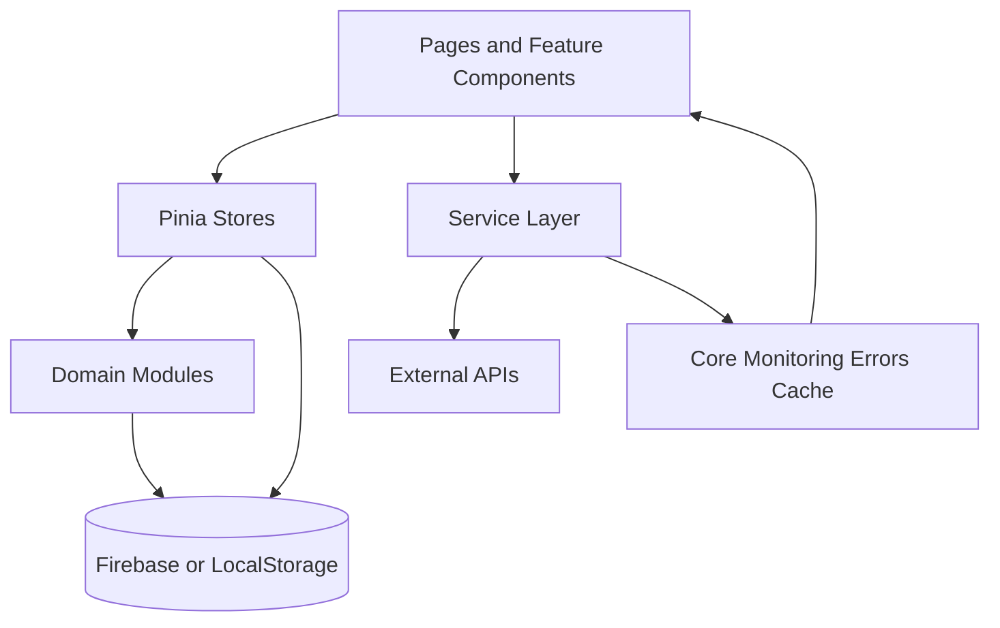

# WanderAI - AI Travel Operating System

Last updated: 2026-06-24

Yeh README aapke project ka full blueprint hai. Isme sirf high-level intro nahi, balki yeh clear map diya gaya hai ki:

- project kya karta hai,
- project ka real mission kya hai,
- har major folder/module/page ka kya role hai,
- aap is project ko long-term me kis direction me le jana chahte ho,
- aur developer perspective se isko kaise run, test, scale aur maintain karna hai.

---

## 1. Project Vision - Aap Is Project Se Kya Karna Chahte Ho

WanderAI ka core idea ek normal travel planner banana nahi hai.

Target yeh hai ki yeh app ek **Travel Operating System** ban jaye jaha user ko travel ke liye alag-alag apps pe jump na karna pade.

### Real product intent

1. Prompt se end-to-end planning
2. Real-time travel intelligence (weather, route, crowd, cost, risk)
3. Personalized planning based on memory and user behavior
4. Solo + group planning dono
5. Online + offline readiness
6. Community + safety + hidden gems + visa advisory
7. Future me SaaS-level admin and analytics operations

Simple words me: user ko idea se itinerary tak, aur itinerary se real journey support tak complete ecosystem provide karna.

---

## 2. Product Positioning

WanderAI ko aap 3 layers me samajh sakte ho:

1. Discovery layer
   Home, destination exploration, trend intelligence
2. Planning layer
   AI planner, budget, plan comparison, roadtrip logic, personalization
3. Travel OS layer
   Trips workspace, profile memory, offline packs, vault, community collaboration, admin

---

## 3. Current Stack

### Frontend

- Vue 3
- Vite
- Vue Router
- Pinia

### Validation and typing

- Zod

### Data and auth

- Firebase (if configured)
- LocalStorage fallback (if Firebase keys missing)

### Quality and automation

- ESLint
- Vitest (unit/component/integration + coverage)
- Playwright (E2E)
- Lighthouse CI
- GitHub Actions CI pipeline

---

## 4. High-Level Architecture



### App bootstrap

- src/main.js
  App creation, Pinia + Router registration, global monitoring init, auth init.

### App shell

- src/App.vue
  Navbar, route rendering, profile menu, geo/offline indicators, footer, floating copilot widget.

### Routing and access control

- src/router/index.js
  Route map + auth guard + admin guard + route redirects.

---

## 5. Active Route Map

### Public routes

- / (Explore/Home)
- /explore (redirect to /)
- /destination
- /destination/:id
- /planner
- /roadtrips
- /help
- /login
- not found route

### Auth routes

- /trips
- /community
- /group-trips
- /profile

### Admin route

- /admin

Admin email rule:

- email contains admin
- or email ends with @wanderai.local

### Legacy-to-current redirects

- /dashboard -> /trips?section=stats
- /saved-trips -> /trips?section=past
- /travel-os -> /trips?section=offline
- /documents -> /profile?section=vault
- /guides, /security, /faq, /api-keys -> /help with topic query

Note: Iska matlab architecture evolve ho chuka hai. Old page files exist kar sakte hain, par active user journey ab consolidated routes par hai.

---

## 6. Folder-by-Folder Responsibility Map

## src/pages

Yeh route-level screens hain. Major active screens:

1. Home.vue
   Prompt-first exploration and trending travel discovery.
2. Destination.vue
   Destination listing, filtering, maps input analysis.
3. DestinationDetails.vue
   Deep destination intelligence (safety, gems, signals, detail context).
4. Planner.vue
   Core AI planning workspace with preferences, suggestions, plan generation, budget + itinerary output.
5. Trips.vue
   Travel OS central workspace with upcoming/past/drafts/offline/stats/timeline/achievements.
6. Profile.vue
   User memory profile, personalization insights, preference profiles, vault section.
7. Community.vue
   Posts, reviews, destination social pulse, insights previews.
8. GroupTravel.vue
   Collaborative planning: join code, polls, comments, tasks, shared itinerary.
9. RoadtripPlanner.vue
   Roadtrip-specific planning and intelligence tools.
10. Admin.vue
    SaaS style operations dashboard and moderation-like controls.
11. Help.vue
    Setup, security, and usage guidance.
12. Login.vue
    Authentication entry.

## src/stores

Pinia stores as app state backbone:

1. auth.js
   Auth lifecycle, session state, login/signup/logout, user identity helpers.
2. profileMemory.js
   Long-term user preferences, scores, personality, timeline, profile presets.
3. offline.js
   Network status, offline drafts queue, typed offline packs counters.
4. plannerSession.js
   Planner context bridging to group workflows.
5. groupTravel.js
   Group room state, members, invites, polls, tasks, shared itinerary.
6. community.js
   Community feed/posts/reviews/pulse state.
7. vault.js
   Document vault and security metadata state.
8. copilot.js
   Global copilot session/context handling.

## src/modules

Business/domain engines:

1. profile-memory
   Memory persistence, scoring, personalization directives.
2. planner-options
   Multi-option plan modeling and ranking.
3. roadtrip
   Fuel/toll/EV/scenic and route intelligence helpers.
4. travel-intelligence
   Weather/traffic/crowd/season/safety/cost intelligence services.
5. recommendations
   Smart recommendation orchestrator.
6. group-travel
   Group collaboration data logic.
7. scam-alerts
   Safety advisory signals.
8. hidden-gems
   Less-crowded recommendation logic.
9. visa-intelligence
   Travel doc and visa advisory logic.
10. trending
    Dynamic home trending categories engine.
11. command-center
    Prompt memory and command-centric helper logic.

## src/services

Infrastructure and provider adapters:

1. firebase.js
   Cloud DB/auth bridge + local fallback mode.
2. gemini.js and services/ai/*
   Intent extraction, itinerary, budget, recommendation generation.
3. maps/* + routes.js + location.js
   Geocoding, route distance/traffic, location detection.
4. travel/* + weather.js + places.js
   External travel data fetch and normalization.
5. photo/provider.service.ts
   Live destination image resolution.
6. currency.js
   Currency conversion and formatting.

## src/core

Cross-cutting production hardening:

1. core/errors
   Error normalization + user-friendly messages.
2. core/logger
   Leveled logs using env config.
3. core/monitoring
   Global error handlers, network monitoring, request retry/timeout wrappers.
4. core/cache
   Shared cache buckets for live data paths.

## docs

Architecture and roadmap docs:

- docs/travel-os-architecture.md
- docs/profile-memory-architecture.md
- docs/observability-architecture.md
- docs/data-os-migration-roadmap.md
- docs/deployment-production.md

## tests

- tests/unit
- tests/component
- tests/integration
- tests/e2e
- tests/setup.js

---

## 7. End User Experience - Practical Flow

### Flow A: New user planning

1. User Home/Planner pe prompt deta hai.
2. Intent parse hota hai.
3. Planner controls auto-fill hote hain.
4. Itinerary + budget generate hota hai.
5. User plan save karta hai.
6. Plan Trips workspace me visible hota hai.
7. Profile memory improve hoti hai future personalization ke liye.

### Flow B: Personalization loop

1. User multiple trips generate/save karta hai.
2. Profile memory style, budget, mode, food/stay pattern detect karti hai.
3. Next plan generation me memory context inject hota hai.
4. Better aligned suggestions and constraints milte hain.

### Flow C: Group planning

1. Planner context se group ban sakta hai.
2. Members join via code.
3. Polls, tasks, comments, shared itinerary maintain hoti hai.
4. Group budget alignment and decisions collaborative bante hain.

### Flow D: Travel continuity

1. Offline drafts and packs store hote hain.
2. Profile vault docs secure rakhta hai.
3. Trips page user ka travel timeline and progress dikhata hai.

---

## 8. Key Feature Deep Dive

## 8.1 AI Planner Command Workspace

- Prompt-led generation
- Preferences modal and lockable controls
- Itinerary + budget output
- Suggestions and refinement prompts
- Plan comparison and selected-plan persistence
- Roadtrip intelligence panel for compatible modes

## 8.2 Trips Experience Workspace

Sections:

- Upcoming
- Past
- Drafts
- Offline Packs
- Statistics
- Timeline
- Achievements

Yeh route old dashboard, saved-trips, travel-os surfaces ko consolidate karta hai.

## 8.3 Profile and Memory Intelligence

- Personality model
- History summary
- Preference profiles (named presets)
- Budget and travel style behavior insights
- Vault integration

## 8.4 Community and Safety Layer

- Destination-specific posts and reviews
- Trending tags
- Contributor highlights
- Scam alerts preview
- Hidden gems preview

## 8.5 Group Collaboration Layer

- Create group from planner context
- Join by invite code
- Member invites
- Poll voting
- Shared itinerary and tasks
- Comments and shared budget

## 8.6 Admin Operations Surface

- User/trip moderation style controls
- Destination feature toggles
- Community monitoring snapshots
- AI usage/latency/error metrics panels

---

## 9. Live Data and Reliability Policies

Project me strict migration policy define hai:

1. No mock data default policy
2. Live data unavailable ho to graceful empty/error state
3. UI state lifecycle should support loading/error/empty/success
4. Cache-first optimization for critical data surfaces

Runtime hardening:

- request retry and timeout wrappers
- global error capture (Vue + browser + unhandled promise)
- network online/offline monitors
- centralized friendly error mapping

---

## 10. Environment Variables

Create a .env file in project root.

### Required minimum

- VITE_GEMINI_API_KEY

### Recommended for full experience

- VITE_GOOGLE_MAPS_API_KEY
- VITE_OPENWEATHER_API_KEY
- VITE_TOMTOM_API_KEY

### Firebase optional (for cloud auth + persistence)

- VITE_FIREBASE_API_KEY
- VITE_FIREBASE_AUTH_DOMAIN
- VITE_FIREBASE_PROJECT_ID
- VITE_FIREBASE_STORAGE_BUCKET
- VITE_FIREBASE_MESSAGING_SENDER_ID
- VITE_FIREBASE_APP_ID

### Behavior flags

- VITE_REAL_DATA_ONLY
- VITE_NO_MOCK_DATA_POLICY
- VITE_DEMO_MODE
- VITE_LOG_LEVEL

---

## 11. Local Development Setup

1. Install dependencies

```bash
npm install
```

2. Add .env values

3. Run dev server

```bash
npm run dev
```

4. Build production bundle

```bash
npm run build
```

5. Preview build

```bash
npm run preview
```

---

## 12. Scripts Reference

- npm run dev
- npm run build
- npm run preview
- npm run lint
- npm run test
- npm run test:unit
- npm run test:component
- npm run test:integration
- npm run test:coverage
- npm run test:e2e
- npm run test:e2e:ui
- npm run lighthouse
- npm run analyze:bundle
- npm run quality:check

---

## 13. Testing and CI Quality Gates

### Vitest

- Unit/component/integration coverage
- Coverage thresholds set to 80 percent for lines/functions/statements/branches

### Playwright

- E2E smoke in Chromium

### Lighthouse CI

- Performance >= 0.95
- Accessibility >= 0.95
- Best Practices >= 0.95
- SEO >= 0.95

### GitHub Actions pipeline

Workflow: .github/workflows/ci.yml

Jobs:

1. quality
   lint + unit + component + integration + coverage + build
2. e2e
   playwright smoke
3. lighthouse
   lhci quality gate

---

## 14. Data Persistence Model

Current mode supports dual persistence:

1. Firebase configured
   Cloud auth + cloud trips storage
2. Firebase missing
   LocalStorage fallback mode

Major local keys include:

- auth session
- auth users
- user-scoped saved trips
- profile memory
- offline packs/drafts
- community/group helper data

---

## 15. What Is Active vs What Is Legacy

Important for team clarity:

1. Active app flow prefers:
   Home -> Planner -> Trips -> Profile/Community/Group
2. Old routes like dashboard, travel-os, saved-trips are redirected.
3. Some legacy page files still repository me exist karte hain for backward compatibility/history.

Recommendation:

- Route map ko source of truth treat karo, not just page file presence.

---

## 16. Roadmap Direction (Practical)

### Near term

1. Remaining UI state lifecycle audit complete karna
2. Route/page cleanup to reduce legacy overlap
3. Stronger integration tests for no-mock and outage behavior
4. Better analytics for cache hit rate and API failure pattern

### Mid term

1. Profile memory cloud sync
2. Recommendation feedback loop
3. More robust copilot context awareness
4. Production admin controls with real backend sources

### Long term

1. Full Travel OS suite
2. Enterprise-grade observability and governance
3. Multi-tenant SaaS capabilities

---

## 17. Known Product Truths

1. This project is already beyond a demo and structured like an evolving product platform.
2. Architecture intentionally modular rakha gaya hai to support phased shipping.
3. User experience now command-center-first and memory-aware direction me evolve ho raha hai.
4. Live-data correctness and graceful degradation project ke core principles hain.

---

## 18. Developer Notes

1. Route redirects samajh ke debug karo, kyunki kuch pages now consolidated experiences me merge ho chuke hain.
2. New feature add karte waqt store + module + service boundary maintain karo.
3. Any new external data block should include loading/error/empty/success state.
4. Test update without coverage drop and run quality gate before merge.

---

## 19. One-Line Summary

WanderAI ka objective ek smart travel planner banana nahi, balki ek memory-driven, community-enabled, reliable Travel Operating System banana hai jo inspiration se real trip execution tak complete support de.
