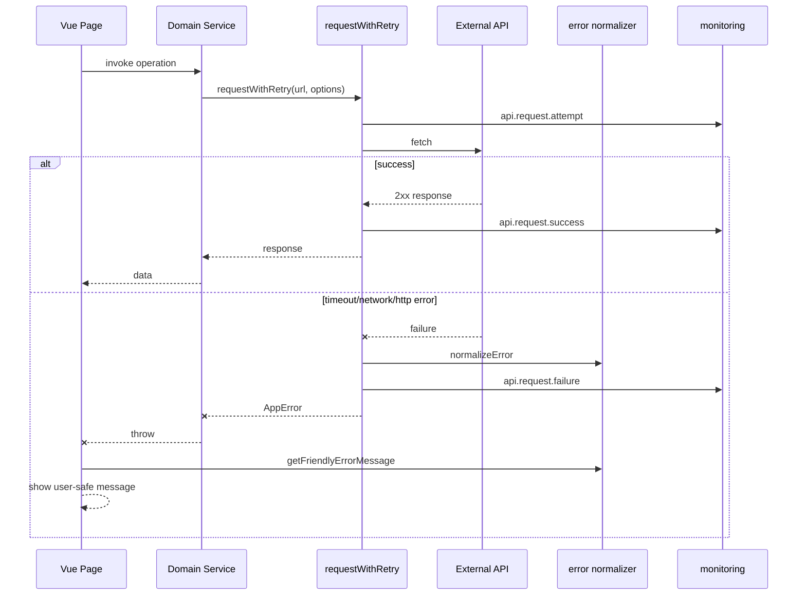
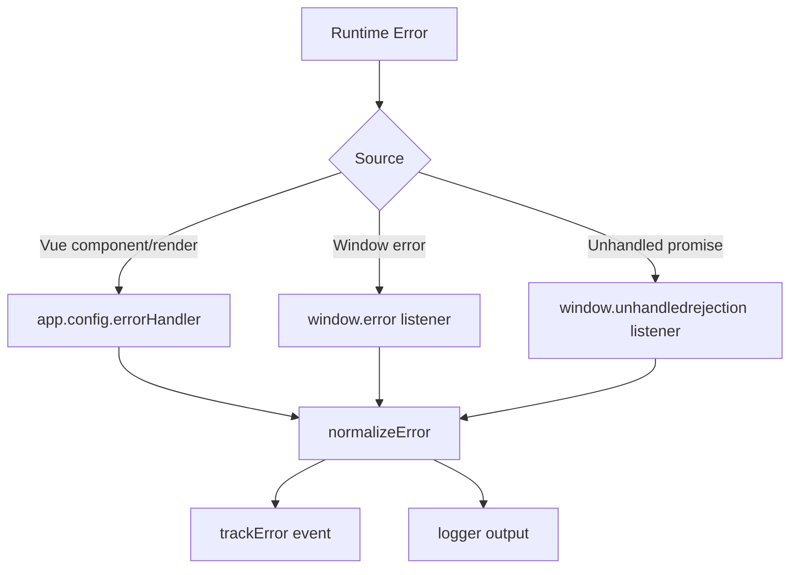

# Observability Architecture

Last updated: 2026-06-19

This document describes the implemented observability layer under src/core and how it integrates into the active runtime without changing existing UX behavior.

## Objectives

- Global error capture for runtime and unhandled promise issues.
- API request tracking with retry and timeout strategy.
- Offline awareness and network state monitoring.
- Reusable loading-state primitives.
- Friendly user-facing error messages from normalized error types.

## Implemented Modules

## src/core/logger

- index.js
- Provides namespaced logger instances.
- Supports level-based logging via VITE_LOG_LEVEL.
- Safe metadata serialization to avoid logger crashes.

## src/core/errors

- index.js
- Defines AppError and common error codes.
- Normalizes arbitrary thrown errors into predictable shape.
- Exposes helper for friendly user messages.

## src/core/monitoring

- index.js
- In-memory event timeline for monitoring events.
- API attempt/success/failure and error capture helpers.

- request.js
- requestWithRetry() wrapper around fetch.
- Handles timeout using AbortController.
- Handles retry for network/timeouts and retryable HTTP statuses.
- Tracks request lifecycle through monitoring events.
- Produces normalized AppError errors.

- network.js
- Global online/offline detection and event tracking.
- Reactive network state for UI/composables.

- global.js
- Installs Vue app-level and browser global error handlers.
- Captures errors from:
  - app.config.errorHandler
  - window.error
  - window.unhandledrejection

- loading.js
- createLoadingState() utility for reusable loading orchestration.

## Runtime Integration

## Bootstrap integration

- src/main.js
- initNetworkMonitoring() starts online/offline monitoring.
- installGlobalErrorHandlers(app) enables global error capture.

## Service layer integration

Network requests in active TypeScript service modules now route through requestWithRetry:

- src/services/ai/planner.service.ts
- src/services/ai/itinerary.service.ts
- src/services/ai/budget.service.ts
- src/services/ai/recommendation.service.ts
- src/services/maps/geocoding.service.ts
- src/services/maps/route.service.ts
- src/services/travel/weather.service.ts
- src/services/travel/places.service.ts

JavaScript compatibility services also use the wrapper where active:

- src/services/location.js
- src/services/currency.js

## Page layer integration

Friendly error messaging and reusable loading utility integrated without visual redesign:

- src/pages/Planner.vue
- src/pages/Home.vue
- src/pages/Destination.vue

## End-to-End Error Flow

## Global Error Capture Flow

## Retry and Timeout Policy

Default request behavior in requestWithRetry:

- Timeout: 12s default, overridden per operation.
- Retries: 1 retry by default for retryable failures.
- Retryable statuses: 408, 409, 425, 429, 500, 502, 503, 504.
- Offline short-circuit: throws OFFLINE AppError before network call when navigator reports offline.

## UX Compatibility Guarantee

- Existing page structure and component hierarchy remain unchanged.
- Existing loading visuals remain intact.
- Existing interaction patterns remain intact.
- Improvements are internal to transport, error handling, and diagnostics.

## Suggested Next Improvements

1. Persist monitoring events to remote sink (Sentry/Datadog/OpenTelemetry bridge).
2. Add correlation IDs per user action and propagate across API calls.
3. Add a silent health-check module for API latency baselines.
4. Add alerting thresholds for failure rate and timeout spikes.
