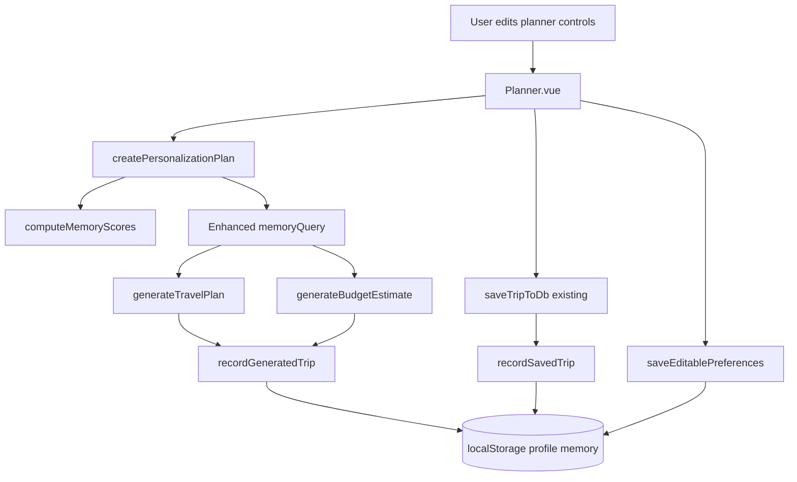

# Profile Memory Architecture

Last updated: 2026-06-19

This module provides user-level memory and personalization for itinerary generation.

Location:

- src/modules/profile-memory

## Goals

- Persist traveler preferences and historical behavior.
- Personalize future itinerary and budget requests.
- Enable editable preferences from planner.
- Compute confidence/quality score of memory data.

## Stored Memory Model

Stored fields:

- travelStyle
- budgetPreference
- favoriteDestinations
- transportPreference
- foodPreference
- stayPreference
- previousTrips

Supporting metadata:

- counters.generations
- counters.savedTrips
- counters.preferenceUpdates
- metadata.lastPersonalizationAt

Storage:

- localStorage scoped by user id: roam_profile_memory_v1_{userId}

## Module Breakdown

## storage.js

- loadProfileMemory(userId)
- saveProfileMemory(memory)
- saveEditablePreferences(userId, patch)
- recordGeneratedTrip(userId, trip)
- recordSavedTrip(userId, trip)

Responsibilities:

- Validation and normalization
- Merge/dedupe favorite destinations
- Previous trip snapshot management
- Preference updates from user edits and generated/saved trips

## scoring.js

- computeMemoryScores(profileMemory)

Returns:

- overall score (0-100)
- confidence band (Low/Medium/High)
- per-dimension breakdown:
  - travelStyle
  - budgetPreference
  - favoriteDestinations
  - transportPreference
  - foodPreference
  - previousTrips

## personalization.js

- createPersonalizationPlan({ input, profileMemory })

Returns:

- effectiveInput: adjusted planner inputs
- memoryScores: computed score
- memoryDirective: prompt-ready memory context
- memoryQuery: enhanced query for AI generation
- personalizationNotes: short summary

## Integration Points

Planner integration:

- src/pages/Planner.vue

Flow:

1. Load memory at mount based on user id.
2. Apply stored preferences to planner controls.
3. Allow manual save of edited preferences.
4. On generate:
   - compute personalization plan
   - enrich AI query with memory context
   - pass sourceQuery + memoryContext into itinerary/budget generators
   - record generated trip in memory
5. On save trip:
   - persist trip in existing storage
   - mark memory with saved trip + destination affinity update

AI services integration:

- src/services/ai/itinerary.service.ts
- src/services/ai/budget.service.ts

Added prompt context:

- Source Query
- Personalization Memory block

## Data Flow Diagram

## UX Impact

No major UX restructuring.

Added in Planner:

- Memory score strip
- Personalization notes
- Save Preferences to Memory action

Core planning flow, generated itinerary view, and budget layout are preserved.
